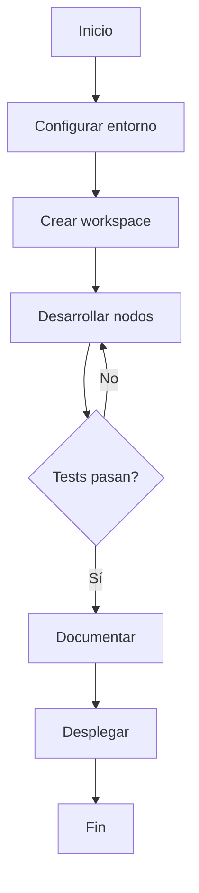

# Ejercicios Prácticos - Markdown

> 📚 [Volver al Índice de Documentación](../README.md)

Este documento contiene ejercicios prácticos para reforzar los conceptos de las guías de Markdown.

---

## Nivel Principiante

### Sección 1: Sintaxis Básica

> 📖 **Teoría:** [Guía Markdown Principiante - Sintaxis](Guia_Markdown_Principiante.md#sintaxis-básica)

#### Ejercicio 1.1: Crear archivo Markdown
Crea un archivo llamado `mi_primer_markdown.md` y escribe:

```markdown
# Mi Primer Documento

Este es mi primer documento en Markdown.

## Caracteres especiales

- Asterisco: \*
- Hash: \#
- Backtick: \`
```

#### Ejercicio 1.2: Escapar caracteres
Escribe un texto que muestre literalmente:
```
*Esto no está en cursiva*
**Esto no está en negrita**
[Esto no es un enlace]
```

---

### Sección 2: Encabezados

> 📖 **Teoría:** [Guía Markdown Principiante - Encabezados](Guia_Markdown_Principiante.md#encabezados)

#### Ejercicio 2.1: Jerarquía de encabezados
Crea un documento con esta estructura:

```markdown
# Título del Proyecto

## Introducción

### Antecedentes

### Objetivos

#### Objetivo General

#### Objetivos Específicos

## Metodología

### Fase 1

### Fase 2

## Conclusiones
```

#### Ejercicio 2.2: Encabezados alternativos
Usa la sintaxis alternativa para H1 y H2:

```markdown
Título Principal
================

Sección Importante
------------------

Contenido aquí.
```

---

### Sección 3: Párrafos y Líneas

> 📖 **Teoría:** [Guía Markdown Principiante - Párrafos](Guia_Markdown_Principiante.md#párrafos-y-saltos-de-línea)

#### Ejercicio 3.1: Párrafos
Crea un documento con 3 párrafos separados correctamente:

```markdown
Este es el primer párrafo. Habla sobre el proyecto.

Este es el segundo párrafo. Describe la metodología.

Este es el tercer párrafo. Presenta conclusiones.
```

#### Ejercicio 3.2: Saltos de línea
Escribe un poema con saltos de línea:

```markdown
Rosas son rojas  
Violetas son azules  
Markdown es genial  
Y tú también lo eres
```

---

### Sección 4: Énfasis y Formato

> 📖 **Teoría:** [Guía Markdown Principiante - Énfasis](Guia_Markdown_Principiante.md#énfasis-y-formato)

#### Ejercicio 4.1: Negrita y cursiva
Escribe un párrafo que use todos los tipos de énfasis:

```markdown
Este texto tiene **negrita**, *cursiva*, y ***ambos***.

También puedes usar _cursiva_ y __negrita__.

Combinado: **negrita con _cursiva_ dentro**.
```

#### Ejercicio 4.2: Tachado
Crea una lista de tareas:

```markdown
## Tareas

- ~~Completar documentación~~
- ~~Revisar código~~
- Desplegar aplicación
- Escribir tests
```

---

### Sección 5: Listas

> 📖 **Teoría:** [Guía Markdown Principiante - Listas](Guia_Markdown_Principiante.md#listas)

#### Ejercicio 5.1: Lista no ordenada
Crea una lista de requisitos del sistema:

```markdown
## Requisitos del Sistema

- Ubuntu 22.04
- Python 3.10+
- ROS2 Humble
- 8GB RAM mínimo
- 50GB espacio en disco
```

#### Ejercicio 5.2: Lista ordenada
Crea un tutorial paso a paso:

```markdown
## Instalación

1. Actualizar sistema
2. Instalar dependencias
3. Clonar repositorio
4. Compilar proyecto
5. Ejecutar aplicación
```

#### Ejercicio 5.3: Listas anidadas
Crea una estructura anidada:

```markdown
## Estructura del Proyecto

1. Frontend
   - React
   - TypeScript
   - CSS Modules
2. Backend
   - Python
   - FastAPI
   - PostgreSQL
3. DevOps
   - Docker
   - GitHub Actions
```

#### Ejercicio 5.4: Lista de tareas
Crea una checklist:

```markdown
## Progreso del Proyecto

- [x] Diseño inicial
- [x] Configuración del entorno
- [ ] Desarrollo del núcleo
- [ ] Tests unitarios
- [ ] Documentación
- [ ] Despliegue
```

---

### Sección 6: Enlaces

> 📖 **Teoría:** [Guía Markdown Principiante - Enlaces](Guia_Markdown_Principiante.md#enlaces)

#### Ejercicio 6.1: Enlaces inline
Crea una sección de recursos:

```markdown
## Recursos Útiles

- [Documentación ROS2](https://docs.ros.org/en/humble/)
- [Python Tutorial](https://docs.python.org/3/tutorial/)
- [GitHub Guides](https://guides.github.com/)
```

#### Ejercicio 6.2: Enlaces con título
Añade títulos a los enlaces:

```markdown
[ROS2](https://docs.ros.org/en/humble/ "Documentación oficial de ROS2 Humble")

[Google](https://www.google.com "Motor de búsqueda")
```

#### Ejercicio 6.3: Enlaces de referencia
Usa enlaces de referencia:

```markdown
Más información en [ROS2 Docs][ros2] y [Python Docs][python].

[ros2]: https://docs.ros.org/en/humble/
[python]: https://docs.python.org/3/
```

#### Ejercicio 6.4: Enlaces a secciones
Crea un índice con enlaces internos:

```markdown
## Índice

- [Introducción](#introducción)
- [Instalación](#instalación)
- [Uso](#uso)
- [Contribuir](#contribuir)

## Introducción

Contenido...

## Instalación

Contenido...
```

---

### Sección 7: Imágenes

> 📖 **Teoría:** [Guía Markdown Principiante - Imágenes](Guia_Markdown_Principiante.md#imágenes)

#### Ejercicio 7.1: Imagen básica
Añade una imagen:

```markdown
## Logo del Proyecto


```

#### Ejercicio 7.2: Imagen con título
Añade una imagen con descripción:

```markdown

```

#### Ejercicio 7.3: Imagen como enlace
Crea una imagen clicable:

```markdown
[](https://docs.ros.org/en/humble/)
```

---

### Sección 8: Comentarios

> 📖 **Teoría:** [Guía Markdown Principiante - Comentarios](Guia_Markdown_Principiante.md#comentarios)

#### Ejercicio 8.1: Comentarios ocultos
Añade comentarios a tu documento:

```markdown
# Documentación

<!-- TODO: Revisar esta sección -->
<!-- Autor: Tu nombre -->
<!-- Fecha: 2024-01-15 -->

Contenido visible.

<!-- 
Comentario multilínea:
- Revisar ortografía
- Añadir ejemplos
- Actualizar enlaces
-->

Más contenido visible.
```

---

## Nivel Intermedio

### Sección 1: Bloques de Código

> 📖 **Teoría:** [Guía Markdown Intermedio - Código](Guia_Markdown_Intermedio.md#bloques-de-código)

#### Ejercicio 1.1: Código inline
Escribe un tutorial usando código inline:

```markdown
## Comandos Básicos

Para listar archivos, usa `ls`.
Para cambiar de directorio, usa `cd <directorio>`.
El comando `pwd` muestra el directorio actual.
```

#### Ejercicio 1.2: Bloques de código
Crea ejemplos en diferentes lenguajes:

````markdown
```python
def hola_mundo():
    print("Hola, mundo!")
```

```bash
#!/bin/bash
echo "Hola desde Bash"
```

```javascript
function hola() {
    console.log("Hola desde JavaScript");
}
```
````

#### Ejercicio 1.3: Bloque sin lenguaje
Muestra un archivo de configuración:

```markdown
```text
# Configuración
DEBUG=True
HOST=localhost
PORT=8080
```
```

---

### Sección 2: Citas en Bloque

> 📖 **Teoría:** [Guía Markdown Intermedio - Citas](Guia_Markdown_Intermedio.md#citas-en-bloque)

#### Ejercicio 2.1: Cita básica
Añade una cita famosa:

```markdown
> La simplicidad es la máxima sofisticación.
>
> — Leonardo da Vinci
```

#### Ejercicio 2.2: Citas anidadas
Crea citas con niveles:

```markdown
> Cita de nivel 1
>> Cita de nivel 2
>>> Cita de nivel 3
```

#### Ejercicio 2.3: Cita con elementos
Incluye lista y código en una cita:

```markdown
> ### Importante
>
> Recuerda estos comandos:
>
> - `ros2 node list`
> - `ros2 topic list`
> - `ros2 service list`
>
> Para más información, ver documentación.
```

---

### Sección 3: Tablas

> 📖 **Teoría:** [Guía Markdown Intermedio - Tablas](Guia_Markdown_Intermedio.md#tablas)

#### Ejercicio 3.1: Tabla básica
Crea una tabla de comparación:

```markdown
| Característica | ROS1 | ROS2 |
|----------------|------|------|
| Middleware | Custom | DDS |
| Tiempo Real | No | Sí |
| Multi-robot | Difícil | Nativo |
| Seguridad | Básica | SROS2 |
```

#### Ejercicio 3.2: Tabla con alineación
Crea una tabla alineada:

```markdown
| Comando | Descripción | Ejemplo |
|:--------|:-----------:|--------:|
| `ls` | Lista archivos | `ls -la` |
| `cd` | Cambia directorio | `cd /home` |
| `pwd` | Directorio actual | `pwd` |
```

#### Ejercicio 3.3: Tabla con formato
Usa formato dentro de tablas:

```markdown
| Elemento | Sintaxis | Resultado |
|----------|----------|-----------|
| Negrita | `**texto**` | **texto** |
| Cursiva | `*texto*` | *texto* |
| Código | `` `code` `` | `code` |
```

---

### Sección 4: Separadores

> 📖 **Teoría:** [Guía Markdown Intermedio - Separadores](Guia_Markdown_Intermedio.md#separadores-horizontales)

#### Ejercicio 4.1: Usar separadores
Separa secciones claramente:

```markdown
## Sección 1

Contenido de la primera sección.

---

## Sección 2

Contenido de la segunda sección.

***

## Sección 3

Contenido de la tercera sección.
```

---

### Sección 5: Listas de Definición

> 📖 **Teoría:** [Guía Markdown Intermedio - Definiciones](Guia_Markdown_Intermedio.md#listas-de-definición)

#### Ejercicio 5.1: Glosario técnico
Crea un glosario:

```markdown
## Glosario ROS2

**Nodo**
: Unidad de procesamiento que realiza cálculos

**Topic**
: Canal de comunicación para mensajes

**Service**
: Comunicación request/response

**Action**
: Tareas de larga duración con feedback
```

---

### Sección 6: Notas al Pie

> 📖 **Teoría:** [Guía Markdown Intermedio - Notas](Guia_Markdown_Intermedio.md#notas-al-pie)

#### Ejercicio 6.1: Notas simples
Añade notas al pie:

```markdown
ROS2 usa DDS[^1] como middleware de comunicación.

[^1]: Data Distribution Service, estándar OMG para sistemas distribuidos.
```

#### Ejercicio 6.2: Múltiples notas
Usa varias notas:

```markdown
ROS2 Humble[^humble] es una versión LTS[^lts] diseñada para Ubuntu 22.04.

[^humble]: Versión de ROS2 lanzada en 2022.
[^lts]: Long Term Support, soporte extendido por 5 años.
```

---

### Sección 7: Abreviaturas

> 📖 **Teoría:** [Guía Markdown Intermedio - Abreviaturas](Guia_Markdown_Intermedio.md#abreviaturas)

#### Ejercicio 7.1: Definir abreviaturas
Crea definiciones:

```markdown
El robot usa PID para control de motores.

*[PID]: Proporcional Integral Derivativo
*[ROS]: Robot Operating System
*[DDS]: Data Distribution Service
```

---

## Nivel Avanzado

### Sección 1: HTML Embebido

> 📖 **Teoría:** [Guía Markdown Avanzado - HTML](Guia_Markdown_Avanzado.md#html-embebido)

#### Ejercicio 1.1: Texto con color
Usa HTML para color:

```markdown
<p style="color: red;">Este texto es rojo.</p>
<p style="color: blue;">Este texto es azul.</p>
<p style="color: green;">Este texto es verde.</p>
```

#### Ejercicio 1.2: Imagen con tamaño
Controla el tamaño de imagen:

```markdown

```

#### Ejercicio 1.3: Detalles colapsables
Crea contenido expandible:

```markdown
<details>
  <summary>Click para ver solución</summary>
  
  ```python
  def solucion():
      return 42
  ```
</details>
```

#### Ejercicio 1.4: Tabla avanzada
Usa HTML para tabla compleja:

```markdown
<table>
  <tr>
    <th colspan="2">Sistema</th>
  </tr>
  <tr>
    <td>OS</td>
    <td>Ubuntu 22.04</td>
  </tr>
  <tr>
    <td>ROS</td>
    <td>ROS2 Humble</td>
  </tr>
</table>
```

---

### Sección 2: GitHub Flavored Markdown

> 📖 **Teoría:** [Guía Markdown Avanzado - GFM](Guia_Markdown_Avanzado.md#github-flavored-markdown)

#### Ejercicio 2.1: Checklist completa
Crea una checklist de proyecto:

```markdown
## Estado del Proyecto

- [x] Análisis de requisitos
- [x] Diseño del sistema
- [x] Configuración del entorno
- [ ] Implementación del núcleo
- [ ] Tests unitarios
- [ ] Integración continua
- [ ] Documentación
- [ ] Despliegue
```

#### Ejercicio 2.2: Autolinks
Escribe URLs que se convierten automáticamente:

```markdown
Visita:
- https://github.com
- www.ejemplo.com
- contacto@proyecto.com
```

---

### Sección 3: Markdown en Obsidian

> 📖 **Teoría:** [Guía Markdown Avanzado - Obsidian](Guia_Markdown_Avanzado.md#markdown-en-obsidian)

#### Ejercicio 3.1: Wikilinks
Crea enlaces estilo Obsidian:

```markdown
Ver [[Guia_ROS2_Principiante]] para más información.

[[Guia_ROS2_Principiante|Guía ROS2 Básica]]

[[Guia_ROS2_Principiante#Nodos-en-ROS2|Sección de Nodos]]
```

#### Ejercicio 3.2: Etiquetas
Añade tags a tu nota:

```markdown
#notas #robotica #ros2
#proyecto/eurobot
#estado/activo
```

#### Ejercicio 3.3: Frontmatter
Añade metadatos YAML:

```markdown
---
title: Documentación del Proyecto
date: 2024-01-15
tags: [robotica, ros2, documentacion]
author: Tu Nombre
status: activo
---

# Contenido

...
```

#### Ejercicio 3.4: Callouts
Usa callouts de Obsidian:

```markdown
> [!note] Nota Importante
> Esta es información destacada.

> [!warning] Precaución
> Ten cuidado con este paso.

> [!tip] Consejo
> Usa `colcon build` para compilar.

> [!info] Información
> ROS2 Humble es LTS hasta 2027.
```

#### Ejercicio 3.5: Diagrama Mermaid
Crea un diagrama de flujo:

````markdown

````

---

### Sección 4: Extensiones Comunes

> 📖 **Teoría:** [Guía Markdown Avanzado - Extensiones](Guia_Markdown_Avanzado.md#extensiones-comunes)

#### Ejercicio 4.1: Fórmulas matemáticas
Escribe fórmulas (si tu procesador lo soporta):

```markdown
Energía: $E = mc^2$

Integral:
$$
\int_0^\infty e^{-x^2} dx = \frac{\sqrt{\pi}}{2}
$$
```

#### Ejercicio 4.2: Encabezado con ID
Añade ID personalizado:

```markdown
## Sección Personalizada {#mi-seccion}

Enlace a [Mi Sección](#mi-seccion)
```

---

### Sección 5: Buenas Prácticas

> 📖 **Teoría:** [Guía Markdown Avanzado - Buenas Prácticas](Guia_Markdown_Avanzado.md#buenas-prácticas)

#### Ejercicio 5.1: README profesional
Crea un README completo:

```markdown
# Nombre del Proyecto

Breve descripción del proyecto.

## Tabla de Contenidos

- [Instalación](#instalación)
- [Uso](#uso)
- [Contribuir](#contribuir)
- [Licencia](#licencia)

## Instalación

```bash
git clone https://github.com/usuario/proyecto.git
cd proyecto
pip install -r requirements.txt
```

## Uso

```python
from proyecto import main
main()
```

## Características

- Característica 1
- Característica 2
- Característica 3

## Requisitos

| Requisito | Versión |
|-----------|---------|
| Python | 3.10+ |
| ROS2 | Humble |
| Ubuntu | 22.04 |

## Contribuir

1. Fork el proyecto
2. Crea una rama (`git checkout -b feature/nueva-funcion`)
3. Commit tus cambios (`git commit -m 'feat: añadir función'`)
4. Push a la rama (`git push origin feature/nueva-funcion`)
5. Abre un Pull Request

## Licencia

Especificar tipo de licencia.
```

#### Ejercicio 5.2: Documentación de código
Documenta una función:

```markdown
## `calcular_trayectoria(punto_inicio, punto_final)`

Calcula la trayectoria óptima entre dos puntos.

### Parámetros

| Parámetro | Tipo | Descripción |
|-----------|------|-------------|
| `punto_inicio` | `tuple` | Coordenadas (x, y) de inicio |
| `punto_final` | `tuple` | Coordenadas (x, y) de destino |

### Retorna

- `list`: Lista de puntos que forman la trayectoria

### Ejemplo

```python
trayectoria = calcular_trayectoria((0, 0), (10, 10))
print(trayectoria)  # [(0, 0), (1, 1), ..., (10, 10)]
```

### Excepciones

- `ValueError`: Si los puntos están fuera del rango válido
```

---

## Ejercicio Final Integrador

### Proyecto: Documentación Completa de un Paquete ROS2

Crea un archivo `README.md` completo para un paquete ROS2 ficticio que incluya:

1. **Encabezado y descripción**
2. **Tabla de contenidos**
3. **Instalación** con bloques de código
4. **Uso** con ejemplos
5. **Nodos** en tabla
6. **Topics** en tabla
7. **Parámetros** en lista
8. **Ejemplos** con código
9. **Troubleshooting** con callouts
10. **Contribuir** con pasos
11. **Licencia**

Usa:
- Encabezados jerárquicos
- Listas ordenadas y no ordenadas
- Tablas con alineación
- Bloques de código con resaltado
- Enlaces inline y de referencia
- Citas
- Separadores
- Callouts (si usas Obsidian)

---

## Limpiar práctica

Elimina los archivos de práctica creados:

```bash
rm mi_primer_markdown.md
rm practica_*.md
```
