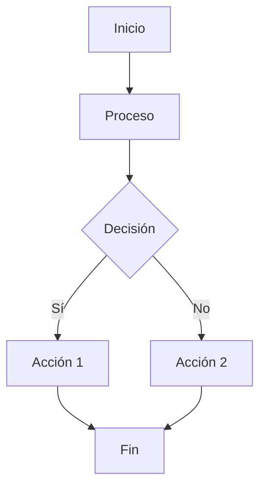
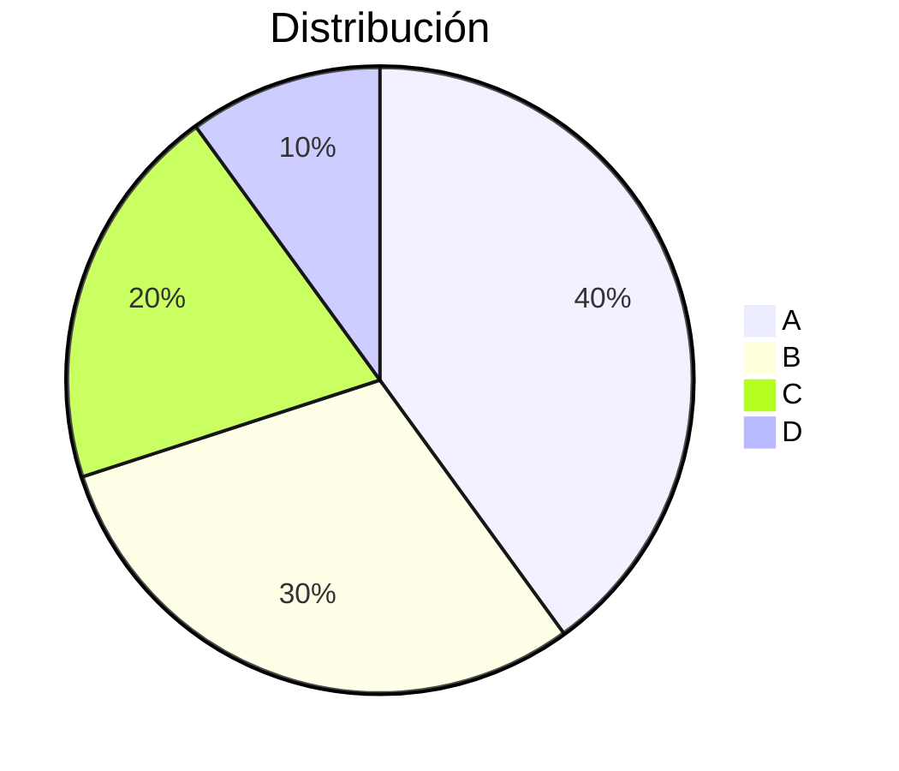
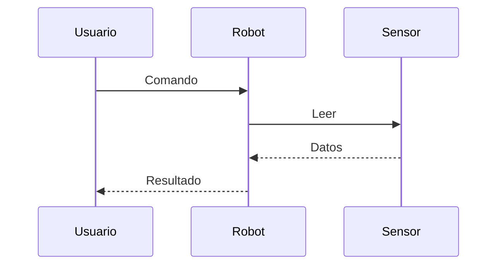
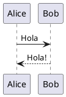
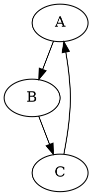

# Guía Markdown - Nivel Avanzado

> 📚 [Volver al Índice de Documentación](../Índice%20Documentación.md)

## Índice
- [HTML Embebido](#html-embebido)
- [GitHub Flavored Markdown](#github-flavored-markdown)
- [Markdown en Obsidian](#markdown-en-obsidian)
- [Extensiones Comunes](#extensiones-comunes)
- [Buenas Prácticas](#buenas-prácticas)
- [Herramientas](#herramientas)

---

## HTML Embebido

### Cuándo usar HTML

- Características no soportadas por Markdown
- Control preciso de formato
- Elementos interactivos
- Compatibilidad con diferentes procesadores

### Elementos HTML comunes

#### Divs y spans

```markdown
<div style="text-align: center;">
  Texto centrado
</div>

Texto con <span style="color: red;">palabra roja</span>.
```

#### Imágenes con tamaño

```markdown

```

#### Tablas avanzadas

```markdown
<table>
  <thead>
    <tr>
      <th colspan="2">Encabezado combinado</th>
    </tr>
  </thead>
  <tbody>
    <tr>
      <td>Celda 1</td>
      <td>Celda 2</td>
    </tr>
  </tbody>
</table>
```

#### Detalles colapsables

```markdown
<details>
  <summary>Click para expandir</summary>
  
  Contenido oculto que se muestra al hacer click.
  
  - Elemento 1
  - Elemento 2
</details>
```

Resultado:
<details>
  <summary>Click para expandir</summary>
  
  Contenido oculto.
</details>

#### Iframes

```markdown
<iframe src="https://ejemplo.com" width="600" height="400"></iframe>
```

#### Videos

```markdown
<video width="320" height="240" controls>
  <source src="video.mp4" type="video/mp4">
</video>
```

### Estilos CSS inline

```markdown
<p style="color: blue; font-size: 18px; text-align: center;">
  Párrafo con estilos
</p>
```

### Markdown dentro de HTML

```markdown
<div>

Este **Markdown** funciona dentro del div.

- Lista 1
- Lista 2

</div>
```

> 💡 **Práctica:** Ejercita HTML en [Ejercicios Markdown - Sección 1](Ejercicios_Markdown.md#sección-1-html-embebido)

---

## GitHub Flavored Markdown

### Lista de tareas

```markdown
- [x] Completado
- [ ] Pendiente
- [ ] Otro pendiente
```

### Tachado

```markdown
~~Texto tachado~~
```

### Autolinks

```markdown
www.ejemplo.com
https://ejemplo.com
usuario@ejemplo.com
```

### Tablas

```markdown
| Col 1 | Col 2 |
|-------|-------|
| A     | B     |
```

### Syntax highlighting

GitHub soporta cientos de lenguajes:

````markdown
```typescript
interface Robot {
  name: string;
  speed: number;
}
```
````

### SHA de commits

```markdown
16c999e8c71134401a78d4d46435517b2271d6ac
mojombo@16c999e8c71134401a78d4d46435517b2271d6ac
mojombo/github-flavored-markdown@16c999e8c71134401a78d4d46435517b2271d6ac
```

### Issues y PRs

```markdown
#123
usuario#123
usuario/repo#123
```

### Menciones

```markdown
@usuario
```

### Emoji

```markdown
:smile:
:rocket:
:robot:
```

> 💡 **Práctica:** Ejercita GFM en [Ejercicios Markdown - Sección 2](Ejercicios_Markdown.md#sección-2-github-flavored-markdown)

---

## Markdown en Obsidian

### Wikilinks

```markdown
[[Nota]]
[[Nota|Texto alternativo]]
[[Nota#Sección]]
[[Nota#Sección|Texto]]
```

### Enlaces embebidos

```markdown
![[Nota]]
![[Nota#Sección]]
![[Imagen.png]]
![[Imagen.png|300]]
```

### Etiquetas (Tags)

```markdown
#etiqueta
#proyecto/eurobot
#estado/activo
```

### Frontmatter (YAML)

```markdown
---
title: Mi Nota
date: 2024-01-15
tags: [robotica, ros2]
author: Usuario
---

# Contenido de la nota
```

### Callouts

```markdown
> [!note] Nota
> Información destacada.

> [!warning] Advertencia
> Cuidado con esto.

> [!tip] Consejo
> Recomendación útil.

> [!info] Información
> Datos adicionales.

> [!success] Éxito
> Todo funcionó correctamente.

> [!failure] Error
> Algo salió mal.

> [!danger] Peligro
> Acción arriesgada.

> [!bug] Bug
> Problema conocido.

> [!example] Ejemplo
> Código de ejemplo.

> [!quote] Cita
> Texto citado.
```

### Diagramas con Mermaid

````markdown

````

### Gráficos

````markdown

````

### Secuencias

````markdown

````

### Código con resaltado de líneas

````markdown
```python hl_lines="2-3"
def funcion():
    resaltado
    resaltado
    no resaltado
```
````

> 💡 **Práctica:** Ejercita Obsidian en [Ejercicios Markdown - Sección 3](Ejercicios_Markdown.md#sección-3-markdown-en-obsidian)

---

## Extensiones Comunes

### Markdown Extra

| Extensión | Descripción |
|-----------|-------------|
| Tablas | Sintaxis de tablas |
| Notas al pie | `[^1]: nota` |
| Listas de definición | `Término: definición` |
| Abreviaturas | `*[ABBR]: Abreviatura` |
| IDs de encabezado | `# Encabezado {#id}` |

### Pandoc

```markdown
# Encabezado {#custom-id}

Texto con [atributo]{.class #id}

~~~ {#mycode .haskell .numberLines startFrom="100"}
código aquí
~~~
```

### MathJax / LaTeX

```markdown
Fórmula inline: $E = mc^2$

Bloque de fórmula:

$$
\int_{-\infty}^{\infty} e^{-x^2} dx = \sqrt{\pi}
$$
```

### Diagramas

#### PlantUML

````markdown

````

#### GraphViz (DOT)

````markdown

````

### Admonitions (docsify, MkDocs)

```markdown
!!! note "Título"
    Contenido de la nota.

!!! warning
    Advertencia importante.
```

> 💡 **Práctica:** Ejercita extensiones en [Ejercicios Markdown - Sección 4](Ejercicios_Markdown.md#sección-4-extensiones-comunes)

---

## Buenas Prácticas

### Legibilidad del código fuente

**Bien:**
```markdown
# Encabezado Principal

Párrafo con **énfasis** y [enlace](url).

- Elemento 1
- Elemento 2
```

**Mal:**
```markdown
#Encabezado Principal
Párrafo con**énfasis**y[enlace](url).
-Elemento 1
-Elemento 2
```

### Consistencia

- Usa el mismo estilo de énfasis (`*` o `_`)
- Mantén consistencia en listas (`-` o `*`)
- Estandariza el formato de enlaces

### Encabezados

- Un solo H1 por documento
- No saltar niveles (H1 → H3)
- Usar anclas para navegación

### Enlaces

- Usar texto descriptivo: `[Documentación](url)` no `[click aquí](url)`
- Preferir enlaces relativos para archivos locales
- Usar referencias para enlaces repetidos

### Imágenes

- Siempre incluir texto alternativo
- Optimizar tamaño de imágenes
- Usar rutas relativas

### Código

- Especificar lenguaje para resaltado
- Mantener bloques de código concisos
- Usar inline para comandos cortos

### Tablas

- Evitar tablas muy anchas
- Alinear columnas para legibilidad
- Considerar listas para datos simples

> 💡 **Práctica:** Aplica buenas prácticas en [Ejercicios Markdown - Sección 5](Ejercicios_Markdown.md#sección-5-buenas-prácticas)

---

## Herramientas

### Editores

| Editor | Plataforma | Características |
|--------|------------|-----------------|
| Obsidian | Multi | Notas, plugins, grafo |
| VS Code | Multi | Extensiones, preview |
| Typora | Multi | WYSIWYG |
| Mark Text | Multi | Open source |
| MacDown | macOS | Nativo |
| iA Writer | Multi | Minimalista |

### Conversores

| Herramienta | Formatos |
|-------------|----------|
| Pandoc | MD ↔ HTML, PDF, DOCX, etc. |
| markdown-pdf | MD → PDF |
| grip | Preview GitHub style |

### Validadores

- markdownlint (VS Code extension)
- remark-lint (CLI)
- Markdown Lint Online

### Extensiones VS Code

- Markdown All in One
- markdownlint
- Markdown Preview Enhanced
- Mermaid support

### Online

- [Dillinger](https://dillinger.io/)
- [StackEdit](https://stackedit.io/)
- [HackMD](https://hackmd.io/)

---

## Resumen de sintaxis avanzada

| Elemento | Sintaxis |
|----------|----------|
| HTML | `<div>`, `<span>`, etc. |
| Callout | `> [!note]` |
| Mermaid | ` ```mermaid ` |
| Wikilink | `[[Nota]]` |
| Frontmatter | `---` YAML `---` |
| Math | `$formula$`, `$$formula$$` |

---

## Recursos adicionales

- [Guía Markdown - Nivel Principiante](Guia_Markdown_Principiante.md)
- [Guía Markdown - Nivel Intermedio](Guia_Markdown_Intermedio.md)
- [Markdown Guide](https://www.markdownguide.org/)
- [GitHub Flavored Markdown Spec](https://github.github.com/gfm/)
- [Obsidian Help](https://help.obsidian.md/)
